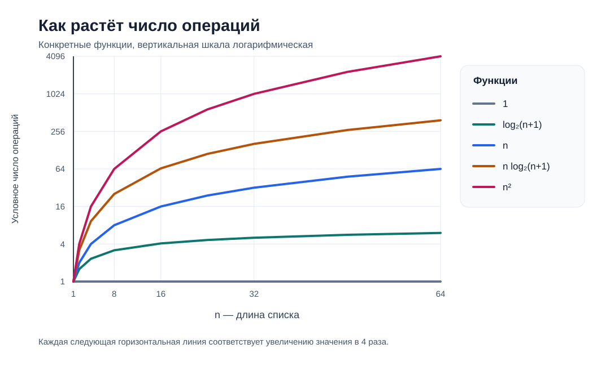

# Сортировка списков и поиск элементов

## Как оценивать сложность алгоритма

Пусть $n$ — длина входного списка, а $T(x)$ — число элементарных операций алгоритма на конкретном входе $x$. В зависимости от задачи можно считать сравнения, присваивания или все операции выбранной модели вычислений. Для оценки худшего случая рассматривают функцию $T_{\mathrm{worst}}(n)=\max_{|x|=n}T(x)$. Время, измеренное в секундах на одном компьютере, не является этой функцией.

Пусть $f,g:\mathbb N\to\mathbb R_{\ge 0}$, причём $g(n)>0$ при достаточно больших $n$. Верхняя асимптотическая оценка определяется так:

```math
f\in O(g)\quad\Longleftrightarrow\quad\exists c>0\;\exists n_0\in\mathbb N\;\forall n\ge n_0:\ f(n)\le c\,g(n).
```

Нижняя асимптотическая оценка:

```math
f\in\Omega(g)\quad\Longleftrightarrow\quad\exists c>0\;\exists n_0\in\mathbb N\;\forall n\ge n_0:\ f(n)\ge c\,g(n).
```

Точная по порядку асимптотическая оценка:

```math
f\in\Theta(g)\quad\Longleftrightarrow\quad\exists c_1,c_2>0\;\exists n_0\in\mathbb N\;\forall n\ge n_0:\ c_1g(n)\le f(n)\le c_2g(n).
```

Например, при $n\ge 1$ выполняется $3n^2\le 3n^2+5n+2\le 10n^2$. Значит, функция $3n^2+5n+2$ принадлежит $\Theta(n^2)$, а также $O(n^2)$ и $\Omega(n^2)$. Запись $O(n^2)$ означает верхнюю границу роста, а не точное число операций.



На рисунке показаны конкретные функции $1$, $\log_2(n+1)$, $n$, $n\log_2(n+1)$ и $n^2$. Вертикальная шкала логарифмическая: каждый следующий уровень соответствует увеличению числа условных операций в четыре раза. График помогает сравнить рост функций, но сам по себе не доказывает сложность конкретного алгоритма. Постоянные множители и накладные расходы на нём не показаны.

Примеры того, при каких действиях встречаются эти порядки роста:

| Верхняя оценка | Пример | Почему возникает |
| --- | --- | --- |
| $O(1)$ | Получить элемент непустого списка по известному индексу | Число действий не зависит от длины списка |
| $O(\log n)$ | Бинарный поиск в отсортированном списке в худшем случае | После каждого сравнения остаётся примерно половина возможных позиций |
| $O(n)$ | Найти отсутствующее значение линейным поиском | Нужно проверить все $n$ элементов |
| $O(n\log n)$ | Сортировка слиянием | На каждом из примерно $\log_2 n$ уровней разделения обрабатываются все $n$ элементов |
| $O(n^2)$ | Обычная пузырьковая сортировка из этого материала | Число сравнений равно $(n-1)+(n-2)+\dots+1=n(n-1)/2$ |

В таблице приведены привычные верхние оценки, тесные для указанных условий. Верхняя оценка не единственна: алгоритм с $\Theta(n)$ операциями также принадлежит $O(n^2)$, но запись $O(n)$ сообщает о нём больше. Для бинарного поиска сортировка входного списка не входит в указанную оценку; для поиска отсутствующего значения линейным перебором рассматривается худший случай.

## Данные для сортировки и поиска

Модуль `random` входит в стандартную библиотеку Python. Функция `random.randint(a, b)` равномерно выбирает целое число из диапазона от `a` до `b` включительно. Повторы в полученном списке допустимы: они пригодятся для проверки сортировок и поиска.

Одна функция считывает параметры из консоли, другая создаёт список. Они не вызывают друг друга: параметры можно прочитать один раз, а исходные данные использовать для нескольких алгоритмов.

```python
"""Содержит примеры для занятия о сортировке и поиске."""

# System imports
import random
import time
from collections.abc import Callable

# External imports

# User imports

#############################################


def read_generation_parameters() -> tuple[int, int, int]:
    """Считывает количество элементов и границы диапазона.

    Returns:
        Количество элементов, нижнюю и верхнюю границы.

    Raises:
        ValueError: Введены нецелые числа или неверные границы.
    """
    count = int(input("Количество элементов: "))
    minimum_value = int(input("Минимальное значение: "))
    maximum_value = int(input("Максимальное значение: "))

    if count < 0:
        raise ValueError("Количество элементов не может быть отрицательным.")

    if minimum_value > maximum_value:
        raise ValueError("Минимальное значение больше максимального.")

    return count, minimum_value, maximum_value


def generate_values(
    count: int,
    minimum_value: int,
    maximum_value: int,
) -> list[int]:
    """Создаёт список случайных целых чисел.

    Args:
        count: Количество элементов.
        minimum_value: Нижняя включительная граница.
        maximum_value: Верхняя включительная граница.

    Returns:
        Список случайных значений.

    Raises:
        ValueError: Количество или границы заданы неверно.
    """
    if count < 0:
        raise ValueError("Количество элементов не может быть отрицательным.")

    if minimum_value > maximum_value:
        raise ValueError("Минимальное значение больше максимального.")

    return [
        random.randint(minimum_value, maximum_value)
        for _ in range(count)
    ]
```

Одни и те же `count`, `minimum_value` и `maximum_value` при повторной генерации обычно дадут **разные** списки. Для сравнения алгоритмов создайте `source_values` один раз и перед каждым запуском делайте `source_values.copy()`. Копия нужна потому, что сортировки изменяют переданный список.

## Опорный пример: пузырьковая сортировка

Алгоритм сравнивает соседние элементы и меняет их местами, если они стоят не по порядку. После первого полного прохода на последнем месте находится максимальный элемент. После каждого следующего прохода отсортированный участок справа увеличивается на один элемент.

```python
def bubble_sort(values: list[int]) -> None:
    """Сортирует список по возрастанию методом пузырька.

    Args:
        values: Изменяемый исходный список.
    """
    for end_index in range(len(values) - 1, 0, -1):
        for index in range(end_index):
            if values[index] > values[index + 1]:
                values[index], values[index + 1] = (
                    values[index + 1],
                    values[index],
                )
```

Для списка `[5, 1, 4, 2, 2]` результатом будет `[1, 2, 2, 4, 5]`. Функция сортирует список **на месте** и возвращает `None`. В этом варианте число проходов заранее фиксировано; даже на уже отсортированном списке выполняется $\Theta(n^2)$ сравнений.

## Функции как значения и `*args`

Имя функции без круглых скобок обозначает саму функцию: её можно сохранить в переменной или передать другой функции. Запись `bubble_sort(values)` уже вызывает её.

Звёздочка используется в двух местах с разным смыслом:

```python
def show_arguments(*args: int) -> None:
    """Выводит полученные позиционные аргументы.

    Args:
        *args: Целые числа для вывода.
    """
    print(args)


numbers = [3, 1, 2]
show_arguments(3, 1, 2)
show_arguments(*numbers)
```

В объявлении `*args` собирает любое количество позиционных аргументов в кортеж. При вызове `*numbers` распаковывает элементы списка в отдельные позиционные аргументы. `args` — обычное имя параметра; особый смысл задаёт звёздочка. Именованные аргументы и `**kwargs` здесь не используются.

Функция замера принимает другую функцию и её позиционные аргументы, вызывает её и возвращает результат вместе с прошедшим временем:

```python
def measure_execution_time(
    function: Callable[..., object],
    *args: object,
) -> tuple[object, float]:
    """Вызывает функцию и измеряет время выполнения.

    Args:
        function: Вызываемая функция.
        *args: Её позиционные аргументы.

    Returns:
        Результат функции и время выполнения в секундах.
    """
    start_time = time.time()
    result = function(*args)
    stop_time = time.time()

    return result, stop_time - start_time
```

Аннотация `Callable` указывает, что параметр `function` можно вызвать. Для понимания работы функции замера достаточно проследить, как `*args` собирается при одном вызове и распаковывается при другом.

После написания трёх сортировок можно несколько раз запустить их с одинаковыми параметрами генерации. На каждом повторе создаётся новый исходный список, а все три сортировки получают его отдельные копии. Копирование, проверка результата и вывод на экран находятся вне измеряемого участка:

```python
count, minimum_value, maximum_value = read_generation_parameters()
TRIAL_COUNT = 3

sort_functions = [
    ("Пузырьковая", bubble_sort),
    ("Шейкерная", shaker_sort),
    ("Гномья", gnome_sort),
]

for trial_number in range(1, TRIAL_COUNT + 1):
    source_values = generate_values(count, minimum_value, maximum_value)
    expected_values = sorted(source_values)

    for sort_name, sort_function in sort_functions:
        values_to_sort = source_values.copy()
        _, elapsed_time = measure_execution_time(sort_function, values_to_sort)

        print(f"Повтор {trial_number}, {sort_name}: {elapsed_time:.6f} с")
        print(f"Результат верный: {values_to_sort == expected_values}")
```

Этот фрагмент предназначен для запуска после того, как будут написаны `shaker_sort()` и `gnome_sort()`. `sorted()` здесь служит только для проверки результата. Замер одного запуска на маленьком списке может быть шумным или показывать `0.000000` с; асимптотическую сложность определяют по устройству алгоритма, а не по одному замеру.

## Самостоятельная работа: сортировки

### Шейкерная сортировка

Напишите `shaker_sort(values: list[int]) -> None`, которая сортирует переданный список по возрастанию на месте. Сделайте проход слева направо, перемещая максимум в конец ещё не отсортированного участка, затем проход справа налево, перемещая минимум в начало. После пары проходов сужайте границы. Если за проходы не произошло обменов, завершайте работу досрочно.

### Гномья сортировка

Напишите `gnome_sort(values: list[int]) -> None`, которая сортирует список на месте. Если текущий элемент стоит в правильном порядке относительно предыдущего, двигайтесь вправо. Иначе обменяйте соседей и сделайте шаг влево. У левой границы снова двигайтесь вправо.

Проверьте обе функции на пустом списке, списке из одного элемента, уже отсортированном списке, обратном порядке, отрицательных числах и повторах. Сверьте результат с `sorted()`, но не используйте `sorted()` или `list.sort()` внутри собственных алгоритмов.

## Поиск элемента

Обе функции поиска получают список и искомое целое число. Результат — индекс подходящего элемента или `None`, если значение отсутствует. При повторениях достаточно вернуть **любой** подходящий индекс. Нельзя проверять результат условием `if result`: индекс `0` является успешным результатом. Для отсутствующего элемента используйте `result is None`.

### Линейный поиск

Линейный поиск последовательно просматривает исходный, возможно неотсортированный список и возвращает индекс сразу после обнаружения значения. Если просмотр закончен без совпадения, функция возвращает `None`:

```python
def linear_search(values: list[int], target: int) -> int | None:
    """Ищет значение последовательным перебором.

    Args:
        values: Список для поиска.
        target: Искомое значение.

    Returns:
        Индекс найденного элемента или None.
    """
    for index, value in enumerate(values):
        if value == target:
            return index

    return None
```

Если значение встречается несколько раз, этот вариант возвращает индекс первого вхождения.

### Бинарный поиск

**Предусловие:** список `values` отсортирован по возрастанию. Левая и правая границы обозначают участок, в котором ещё может находиться искомое значение. Сравнение с серединой позволяет исключить половину этого участка:

```python
def binary_search(values: list[int], target: int) -> int | None:
    """Ищет значение в отсортированном списке.

    Args:
        values: Список, отсортированный по возрастанию.
        target: Искомое значение.

    Returns:
        Индекс найденного элемента или None.
    """
    left_index = 0
    right_index = len(values) - 1

    while left_index <= right_index:
        middle_index = (left_index + right_index) // 2
        middle_value = values[middle_index]

        if middle_value == target:
            return middle_index

        if middle_value < target:
            left_index = middle_index + 1
        else:
            right_index = middle_index - 1

    return None
```

При повторениях бинарный поиск может вернуть любой индекс подходящего элемента. Чтобы функция всегда возвращала первое вхождение, понадобился бы другой алгоритм определения границы.

```python
source_values = [8, 3, 8, 1]
sorted_values = sorted(source_values)

print(linear_search(source_values, 8))  # 0
print(binary_search(sorted_values, 8))  # 2
print(binary_search(sorted_values, 10))  # None
```

Для сравнения найдите одно и то же число линейным поиском в `source_values` и бинарным поиском в `sorted(source_values)`. Их индексы могут различаться: они относятся к разным порядкам элементов. Проверьте пустой список, отсутствующее значение, элемент на границе и список с повторениями.

| Алгоритм | Лучший случай | Худший случай | Условие |
| --- | --- | --- | --- |
| Линейный поиск | $\Theta(1)$ | $\Theta(n)$ | Порядок не важен |
| Бинарный поиск | $\Theta(1)$ | $\Theta(\log n)$ | Список отсортирован; $n\ge 2$ |
| Обычная пузырьковая сортировка выше | $\Theta(n^2)$ | $\Theta(n^2)$ | Число проходов фиксировано |
| Шейкерная сортировка с досрочной остановкой | $\Theta(n)$ | $\Theta(n^2)$ | Реализация по заданию выше |
| Гномья сортировка | $\Theta(n)$ | $\Theta(n^2)$ | Реализация по заданию выше |

Если список сначала нужно сортировать, стоимость подготовки тоже учитывается. Для одного поиска выражение «бинарный поиск работает за $O(\log n)$» описывает только **этап поиска по уже отсортированному списку**. При большом числе поисковых запросов предварительная сортировка может окупиться.

## Домашняя работа: другие сортировки

По описаниям в статьях реализуйте глупую, чётно-нечётную сортировку, сортировку расчёской, сортировку вставками и сортировку Шелла. Для каждой функции сохраните общий контракт: она принимает `list[int]`, сортирует его по возрастанию на месте и возвращает `None`. Проверяйте результат на копии одного исходного списка сравнением с `sorted(source_values)`. Для глупой сортировки используйте небольшие списки: возвращение к началу после каждого обмена делает её особенно медленной.

При чтении статей обращайте внимание на правило выбора сравниваемых элементов и на условие завершения. Для сортировки Шелла зафиксируйте последовательность шагов, например начните с половины длины списка и каждый раз делите шаг на два до единицы. Для сортировки расчёской укажите выбранный коэффициент уменьшения шага. Оценка сложности метода Шелла зависит от последовательности шагов; не приписывайте ей одну общую формулу без указания реализации.

- [Пузырьковая сортировка и все-все-все](https://habr.com/ru/articles/204600/) — пузырьковая, шейкерная, чётно-нечётная сортировка и сортировка расчёской.
- [Глупая сортировка и некоторые другие, поумнее](https://habr.com/ru/articles/204968/) — гномья сортировка, вставки и метод Шелла.
